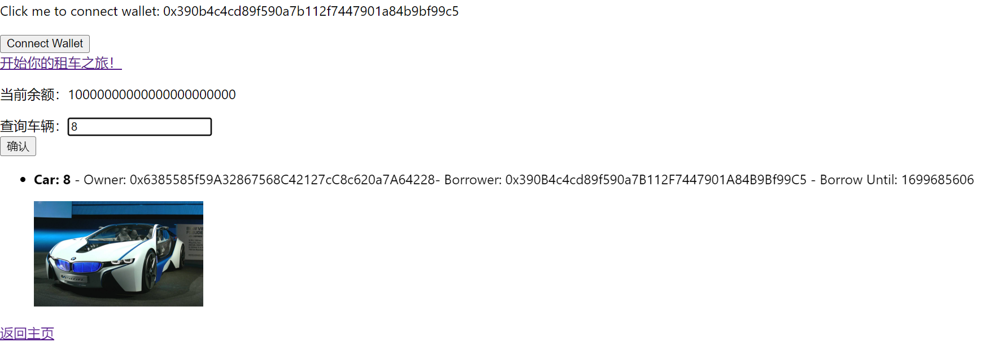

# ZJU-blockchain-course-2023

⬆ 可以️修改成你自己的项目名。

> 第二次作业要求（以下内容提交时可以删除）：
> 
> 简易汽车借用系统，参与方包括：汽车拥有者，有借用汽车需求的用户
>
> 背景：ERC-4907 基于 ERC-721 做了简单的优化和补充，允许用户对NFT进行租借。
> - 创建一个合约，在合约中发行NFT集合，每个NFT代表一辆汽车。给部分用户测试领取部分汽车NFT，用于后面的测试。
> - 在网站中，默认每个用户的汽车都可以被借用。每个用户可以： 
>    1. 查看自己拥有的汽车列表。查看当前还没有被借用的汽车列表。
>    2. 查询一辆汽车的主人，以及该汽车当前的借用者（如果有）。
>    3. 选择并借用某辆还没有被借用的汽车一定时间。
>    4. 上述过程中借用不需要进行付费。
> 
> - （Bonus）使用自己发行的积分（ERC20）完成付费租赁汽车的流程
> - 请大家专注于功能实现，网站UI美观程度不纳入评分标准，但要让用户能够舒适操作。简便起见，可以在网上找图片代表不同汽车，不需要将图片在链上进行存储。

**以下内容为作业仓库的README.md中需要描述的内容。请根据自己的需要进行修改并提交。**

作业提交方式为：**提交视频文件**和**仓库的链接**到指定邮箱。

## 如何运行

补充如何完整运行你的应用。

1. 在本地启动ganache应用。

2. 在 `./contracts` 中安装需要的依赖，运行如下的命令：
    ```bash
    npm install
    ```
3. 在 `./contracts` 中编译合约，运行如下的命令：
    ```bash
    npx hardhat compile
    ```
4. ...
5. ...
6. 在 `./frontend` 中安装需要的依赖，运行如下的命令：
    ```bash
    npm install
    ```
7. 在 `./frontend` 中启动前端程序，运行如下的命令：
    ```bash
    npm run start
    ```

## 功能实现分析

1. 连接账户和MetaMask钱包。
2. 获取初始资金。在连接上账户后，调用carToken合约中的airdrop方法，然后展示余额。
3. 查看自己拥有的汽车列表，基础信息包含汽车编号，拥有者，汽车图片，如果这辆汽车已被借用，则展示出借用者和借用到期日期。
主要通过调用borrowYourCar合约中的getOwnedCar方法和getCarInfo方法，并在前端判断有没有借用者进行有选择地展示。
4. 通过输入汽车编号查询车辆信息。先通过输入框读取想要查询的汽车，在通过borrowYourCar合约中的getCarInfo方法进行查询。
5. 选择并借用某辆没被租用的车一段时间。在UborrowedPage页面在想要租用的车旁输入框输入想要借用的时间，然后通过borrowYourCar合约中的borrowCar方法实现租车。
6. 使用自己发行的CarToken完成付费租赁汽车功能（这个虽然进行了代码实现，但出现了我无法解决的bug。在调用carToken合约的approve函数函数时，尽管参数正确，但无法出现理想结果，即没有弹出MetaMask窗口询问是否授权支付上限请求。尝试很多方法都无法找到问题来源）。


## 项目运行截图

初始页面：


点击Connect Wallet按钮，弹出MetaMask窗口：


添加网络，点击“开始你的租车之旅”：


点击“点击领取初始资金”，这里因为之前已经点击过领取初始资金所以有余额，并且再次点击会出现已经领取过的提示：


点击“查看自己拥有的车”会显示出自己车的信息，如果有车被借出，则会显示借用者和借用时限：


回到主页，点击“查找车辆”，在查询车辆输入框中输入车编号：


回到主页，点击“查找所有空闲的车”：


在想要借的车旁输入时长的输入框中输入想要借用的时间，再点击确认：


如果借用自己的车则会弹出提示“你不能借自己的车！”：


借用其他空闲的车则不会出提示：


可以看到借用后这辆车在UnborrowedPage页面消失：


查询这辆车信息可以看到借用者和借用时限：



## 参考内容

- 课程的参考Demo见：[DEMOs](https://github.com/LBruyne/blockchain-course-demos)。

- ERC-4907 [参考实现](https://eips.ethereum.org/EIPS/eip-4907)

- ChatGPT 3.5

如果有其它参考的内容，也请在这里陈列。
